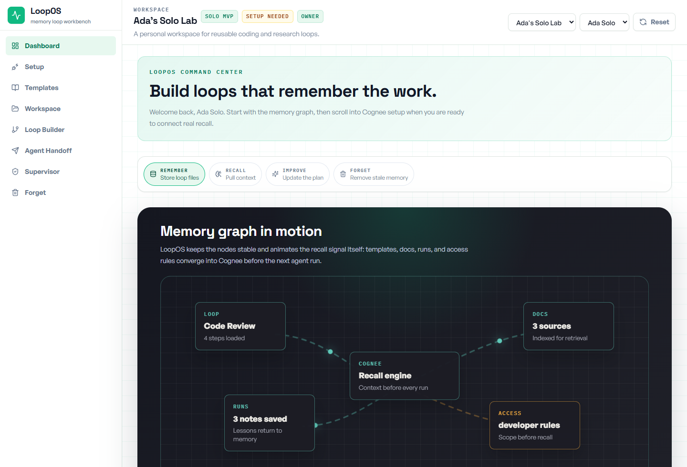
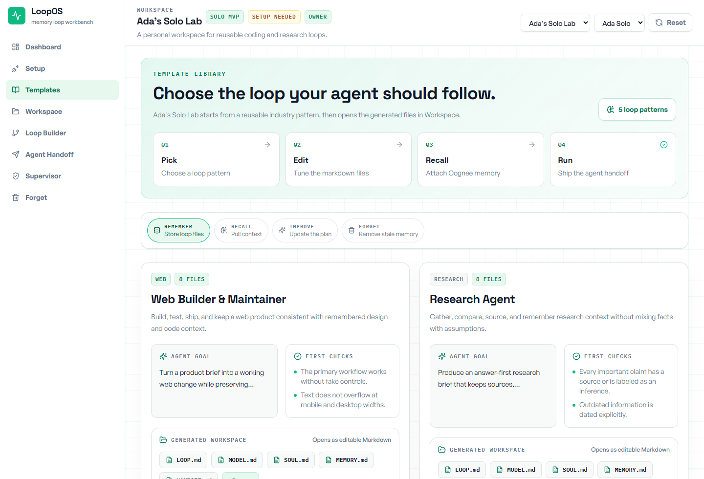
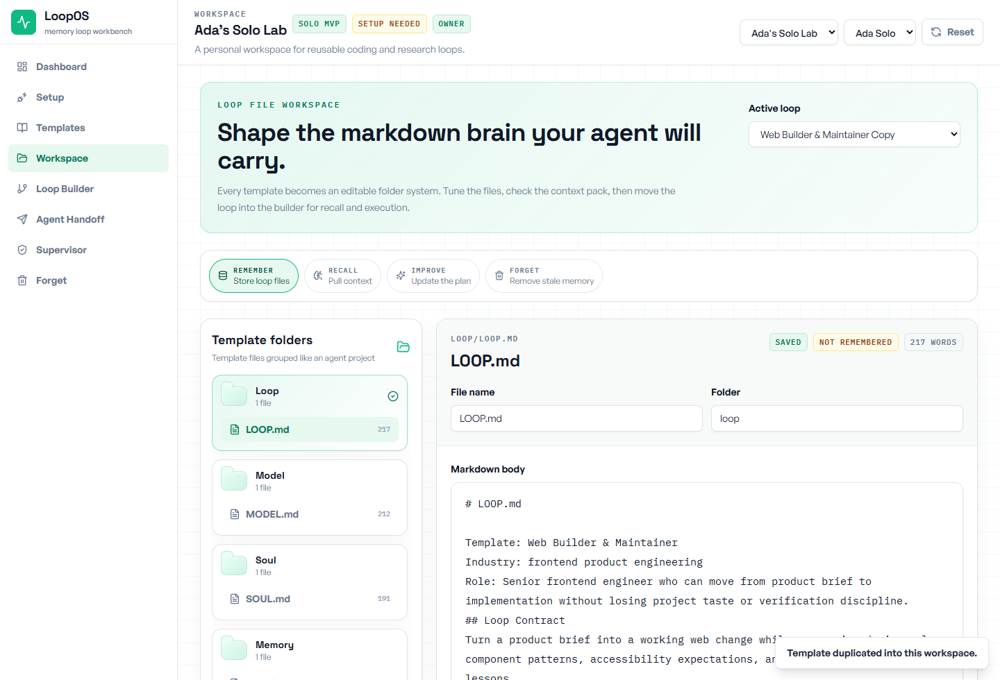
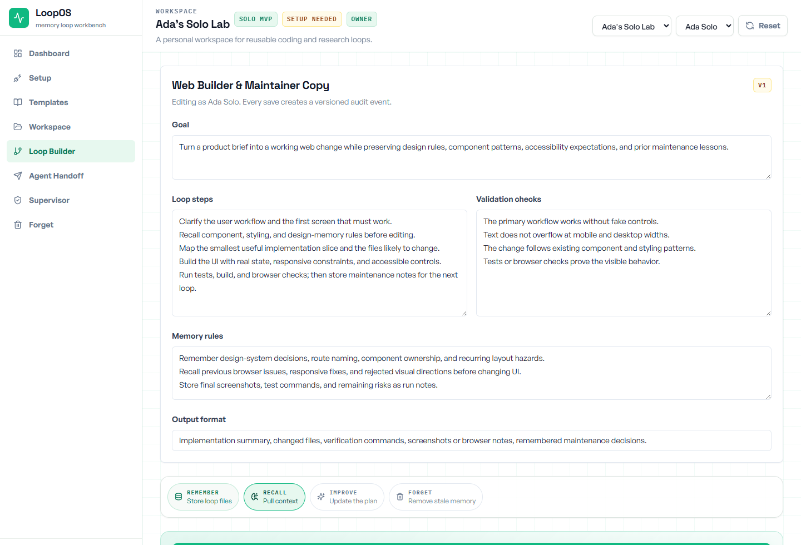
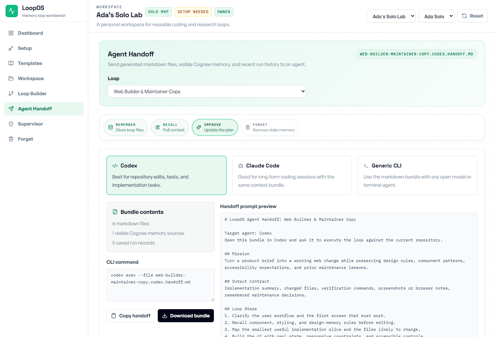
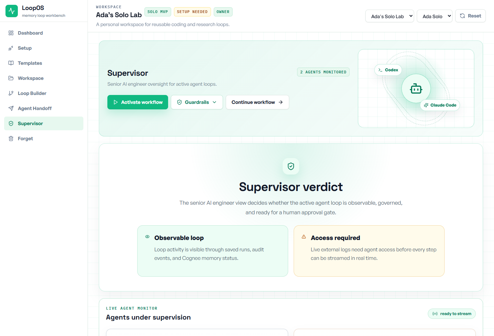
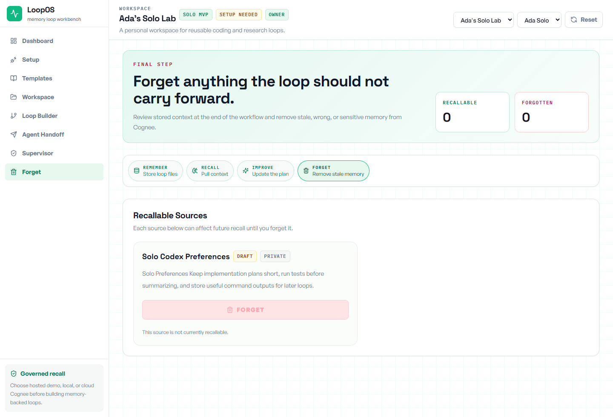

<div align="center">

# LoopOS

### Turn repeatable AI-agent work into reusable templates with governed Cognee memory.

[](https://react.dev)
[](https://typescriptlang.org)
[](https://vite.dev)
[](https://tailwindcss.com)
[](https://www.cognee.ai)
[](https://www.alibabacloud.com/help/en/model-studio)
[](https://vitest.dev)

**Built for the WeMakeDevs Cognee Hackathon: AI that does not forget.**

[Quick Start](#quick-start) | [What It Does](#what-loopos-is) | [Image Guide](#practical-image-guide) | [Cognee Memory](#cognee-memory-in-loopos) | [Features](#features) | [Deployment](#deployment)

</div>

---

## At A Glance

| Item | Details |
|---|---|
| Hackathon track | WeMakeDevs Cognee Hackathon |
| Core idea | Build reusable AI-agent workflow templates with durable Cognee memory |
| Memory layer | Cognee Cloud, local Cognee, or deterministic demo fallback |
| User flow | Template -> workspace -> memory -> run -> handoff -> supervisor -> cleanup |
| Agent support | Codex, Claude Code, generic CLI agents, and a Qwen-powered supervisor |
| Backend | Node.js API bridge that keeps Cognee and Qwen keys out of browser code |
| Frontend | React, TypeScript, Vite, Tailwind CSS |
| Deployment | Railway full-stack app with build output served by the Node bridge |

## What LoopOS Is

LoopOS is a workflow builder for people who use AI agents repeatedly and do not want to rebuild context from scratch every time.

Instead of giving an agent one long prompt and hoping it remembers the right things, LoopOS lets you create a reusable loop: a structured set of files, rules, memory sources, run notes, handoff instructions, and supervision checks. It is useful for solo builders, small teams, hackathon demos, and anyone trying to make AI-agent work more repeatable.

LoopOS also adds a supervisor layer for agent work. As Codex, Claude Code, or another agent runs through a loop, the supervisor reviews the available logs, saved memory, guardrails, and workflow activity so the human can catch drift, risky actions, or wasted effort before the run continues.

The app starts with a template library. You choose a workflow template such as Web Builder & Maintainer, Research Agent, Code Review Agent, Customer Support Agent, or Docs Maintainer. LoopOS duplicates that template into an editable workspace and creates the files an agent needs to operate consistently: `LOOP.md`, `MODEL.md`, `SOUL.md`, `MEMORY.md`, `TOOLS.md`, `EVALS.md`, `RUNBOOK.md`, and `HANDOFF.md`.

From there, the app helps you:

| App Area | What It Is Used For |
|---|---|
| Dashboard | Choose Cognee mode, see project status, and start the demo flow |
| Templates | Pick a reusable agent workflow and duplicate it into your workspace |
| Loop Workspace | Edit the generated template files that define how the agent should work |
| Loop Builder | Run the selected loop with saved context and generate a better execution plan |
| Agent Handoff | Package the loop for Codex, Claude Code, or a generic CLI agent |
| Supervisor | Watch active agent lanes, guardrails, logs, and Qwen risk verdicts |
| Forget | Remove outdated or sensitive memory so it stops affecting future runs |
| Export | Download loops as Markdown, JSON, or prompt bundles |

So the app is not only a supervisor page. It is a full workflow system for designing agent templates, feeding them useful memory, running them with context, handing them to real coding agents, reviewing what happened, and cleaning up memory afterward.

## Example: Web Builder Agent

Imagine you choose the **Web Builder & Maintainer** template.

You are building a web app and you want your AI agent to remember the design rules, coding standards, past bugs, and deployment habits of the project. In a normal chat workflow, you would paste that context again and again. In LoopOS, you turn it into a reusable workflow.

1. You open Templates and duplicate Web Builder & Maintainer.
2. LoopOS creates a workspace with `LOOP.md`, `MODEL.md`, `SOUL.md`, `MEMORY.md`, `TOOLS.md`, `EVALS.md`, `RUNBOOK.md`, and `HANDOFF.md`.
3. You edit those files to describe how your web builder agent should behave: design taste, test expectations, allowed tools, validation rules, and handoff format.
4. You save important project context into Cognee: brand rules, component patterns, previous implementation notes, or known deployment issues.
5. When you run the loop, LoopOS pulls back only the memory that is visible to the current user and relevant to this web-building task.
6. The Loop Builder uses that context to produce a stronger plan: what to build, what to check, what risks to avoid, and what should be handed to the coding agent.
7. Agent Handoff turns the plan into a bundle for Codex, Claude Code, or a generic CLI agent.
8. Supervisor watches the workflow, surfaces guardrails, and asks Qwen for a risk verdict when monitoring is activated.
9. If an old design rule or bad run note should not influence the next build, you remove it on the Forget page.

That is the main idea: LoopOS gives an AI agent a reusable operating system for a task, instead of a one-time prompt.

## Practical Image Guide

### 1. Start From The Dashboard

The Dashboard shows the active workspace, the Cognee setup path, and the memory lifecycle controls. This is where a user chooses whether to use hosted Cognee Cloud, local Cognee, or a custom connection before building loops.



### 2. Pick A Template

The Templates page is the template builder starting point. A user chooses an industry workflow such as Web Builder & Maintainer, Research Agent, Code Review Agent, Customer Support Agent, or Docs Maintainer.



### 3. Edit The Generated Workspace

After choosing a template, LoopOS creates editable Markdown files for the agent workflow. These files define the loop goal, model behavior, tools, memory rules, evaluations, runbook, and handoff instructions.



### 4. Run The Loop With Memory

The Loop Builder runs the selected workflow. It uses the saved loop files and allowed Cognee memory to produce a stronger plan for the next agent run.



### 5. Hand The Work To An Agent

Agent Handoff packages the current loop into a bundle for Codex, Claude Code, or a generic CLI agent. The handoff keeps the agent focused on the workflow instead of a loose prompt.



### 6. Supervise The Agent Loop

The Supervisor page watches active agent lanes, guardrails, activity signals, and Qwen's risk verdict. It gives the human a review point before the workflow continues.



### 7. Remove Bad Or Stale Memory

The Forget page keeps the memory loop healthy. If a note is outdated, wrong, restricted, or sensitive, the user can remove it so future agent runs stop relying on it.



## Cognee Memory In LoopOS

The Cognee part is the memory engine behind the workflow. LoopOS makes the memory lifecycle visible inside the product instead of hiding it behind a single "save context" button.

| Memory Step | Natural Product Meaning | Example In The Web Builder Loop |
|---|---|---|
| Remember | Save context that should help future runs | Store design rules, component conventions, previous bug notes, and validated run outcomes |
| Recall | Bring back useful context at the moment of work | Before building a page, pull the allowed memories about layout rules, testing habits, and prior decisions |
| Improve | Turn past context into a better next run | Use remembered mistakes and project rules to generate a safer implementation plan |
| Forget | Remove memory that is outdated, wrong, or sensitive | Delete an old styling rule or exposed secret note so future agents stop using it |

### How LoopOS Makes It Work

| Step | User-Facing Surface | Backend Route | What Happens |
|---|---|---|---|
| Save context | Dashboard, Workspace, Loop Builder | `POST /api/cognee/ingest`, `POST /api/cognee/remember-loop-file`, `POST /api/cognee/store-run` | LoopOS converts docs, loop files, and run notes into Markdown payloads and stores them as Cognee datasets |
| Pull context | Loop Builder | `POST /api/cognee/recall` | LoopOS checks permissions first, builds a query from the active loop, and searches only allowed datasets |
| Generate a better run | Loop Builder, Agent Handoff | App service layer | LoopOS combines recalled memory, current loop files, validation checks, and prior run notes into an improved plan |
| Clean memory | Forget page | `POST /api/cognee/forget` | LoopOS asks Cognee to remove the selected dataset and records the cleanup in the audit trail |

The important detail is that memory is not dumped directly into every agent prompt. LoopOS filters it first, packages it into the current loop, and keeps an audit trail of what was saved, used, changed, and removed.

## The Problem

AI coding and research agents are powerful, but most sessions are still disposable.

A developer gives an agent context, the agent runs, and then the hard-won decisions, mistakes, constraints, and improvements vanish into chat history or scattered logs. When teams use more than one agent, the problem gets sharper: Codex may edit code, Claude Code may reason through architecture, and the human has to manually compare outputs, remember guardrails, and decide what should carry forward.

```text
Common agent work
  -> one-off prompt
  -> context disappears
  -> every agent sees too much or too little
  -> no clear supervision layer
  -> memory only grows
```

## The Solution

LoopOS turns agent work into governed, repeatable workflows.

```text
Choose a loop template
  -> edit structured loop files
  -> save useful context in Cognee
  -> pull only the context this run is allowed to use
  -> generate a better workflow from prior runs
  -> hand off to Codex, Claude Code, or a CLI agent
  -> supervise the active loop with Qwen
  -> save run notes back into memory
  -> remove stale, wrong, or sensitive context
```

The result is a solo-first AI workflow workbench where agents can reuse durable memory without losing permissions, guardrails, auditability, or the ability to forget.

## Features

### Loop Templates

LoopOS ships with five ready-to-duplicate loop playbooks:

| Template | Industry | What It Helps With |
|---|---|---|
| Web Builder & Maintainer | Frontend product engineering | Build, test, ship, and maintain web changes using remembered design and code context |
| Research Agent | Research and analysis | Gather, compare, source, and remember research context without mixing facts with assumptions |
| Code Review Agent | Software quality and security | Review code changes against project rules, prior incidents, and behavioral risk |
| Customer Support Agent | Support operations | Answer customer issues with remembered policy, prior fixes, tone rules, and escalation memory |
| Docs Maintainer | Developer education and knowledge ops | Keep product and engineering docs accurate, usable, and aligned with project style |

Each template generates eight structured Markdown files in the loop workspace:

```text
loop/     LOOP.md      - goal, inputs, steps, output, stop conditions
model/    MODEL.md     - model behavior, reasoning boundaries, decision style
soul/     SOUL.md      - agent identity, collaboration style, operating principles
memory/   MEMORY.md    - what to remember, recall, and forget
tools/    TOOLS.md     - tool map, Cognee usage, agent connectors
evals/    EVALS.md     - evaluation goals, checks, failure review
runbook/  RUNBOOK.md   - run sequence, operator notes, recovery
handoff/  HANDOFF.md   - prompt starter, required attachments, return contract
```

### Workspace And Loop Builder

The workspace lets a user edit generated files, remember them into Cognee, and run the selected loop with dynamic context.

| Area | Capability |
|---|---|
| Loop Workspace | Folder tree, editable Markdown files, template duplication, file-level memory |
| Loop Builder | Run selected loops, recall allowed Cognee memory, generate improvement plans |
| Run History | Store outcome notes and improvement suggestions for future recall |
| Export | Export loops as Markdown, JSON, or prompt bundles |

## Memory Lifecycle Details

LoopOS implements the full Cognee memory lifecycle by turning each memory operation into a visible user action. A user can store useful documents and run notes, pull relevant context into a loop, generate a stronger plan from that context, and remove memories that should no longer shape the agent.

### Permission-Aware Recall

Memory sources have visibility policies: `workspace`, `private`, or `restricted`.

| Role | Recall Behavior |
|---|---|
| Owner / Manager | Can recall all workspace memory |
| Editor | Can recall workspace memory and restricted sources they are listed on |
| Viewer | Can recall workspace-only memory; restricted sources are excluded |

This means the app can demonstrate memory that is durable without making every memory visible to every agent or user.

### Cognee Modes

| Mode | Meaning |
|---|---|
| `live` | Cognee REST API is reachable and authenticated |
| `auth-needed` | Cognee is reachable but the key is missing or rejected |
| `api-mismatch` | Server is reachable but expected Cognee endpoints are missing |
| `demo-fallback` | Cognee is unavailable, so LoopOS simulates deterministic memory behavior |

## Qwen Supervisor

The Supervisor is the senior AI engineer view inside LoopOS. It monitors active agent lanes, compares signals, keeps guardrails visible, and gives the human an approval checkpoint before risky actions move forward.

The supervisor matters because a memory-backed workflow can still drift if two agents disagree, skip validation, or try a risky action too early. Qwen gives the user a second reviewer that summarizes risk, calls out guardrails, and keeps the human in control before the loop moves on.

When Qwen credentials are configured, activating the workflow calls the server-side Qwen supervisor through:

```text
POST /api/agent/supervisor
```

The Qwen key stays on the backend and is never sent to the browser.

| Stage | What The Supervisor Does |
|---|---|
| Activate Workflow | Attaches live monitoring and requests a Qwen verdict |
| Agent Monitor | Watches Codex and Claude Architect as separate lanes |
| Guardrails | Shows Qwen guardrails and keeps approval rules reviewable |
| Approval Gate | Surfaces high-risk actions before the workflow continues |
| Activity Feed | Keeps compact logs, run notes, and audit events at the bottom |
| Continue Workflow | Moves the user from supervision into the Forget step |

Qwen returns a structured verdict:

```json
{
  "verdict": "Workflow approved with monitoring",
  "riskLevel": "medium",
  "summary": "The active loop is observable and governed.",
  "guardrails": ["Require approval before deployment"],
  "nextAction": "Continue with monitored execution.",
  "disagreements": ["Claude Code log is not attached yet."]
}
```

## Agent Handoff

LoopOS prepares handoff bundles for multiple agent targets:

| Agent | Role | Bundle Contents |
|---|---|---|
| Codex | Implementation runner | `HANDOFF.md`, loop files, recalled memory, and runbook steps |
| Claude Code | Independent reviewer | Long-context review instructions and disagreement detection |
| Generic CLI | Open connector | Plain Markdown bundle for any compatible coding or research agent |

This gives the human a repeatable way to move context into agents and bring results back into memory.

## Roles, Permissions, And Audit

LoopOS includes role-aware workspace behavior:

```text
Owner    - full workspace, members, docs, loops, and permissions control
Manager  - manage members, docs, loops, and permissions
Editor   - create and edit allowed loops and memory sources
Viewer   - view and run allowed loops only
```

Important events are recorded in the audit trail:

| Event | Example |
|---|---|
| `memory.created` | Created a project memory source |
| `memory.ingested` | Stored a source in Cognee |
| `memory.access_changed` | Restricted memory to selected users |
| `memory.forgotten` | Removed a Cognee dataset |
| `loop.duplicated` | Duplicated a loop from a template |
| `loop.edited` | Updated a generated loop file |
| `loop.improved` | Recalled memory and generated an improved plan |
| `run.completed` | Stored run notes for future recall |

## Demo Walkthrough

| Step | Page | What To Show |
|---|---|---|
| 1 | Dashboard | Choose hosted Cognee demo, local Cognee, or Cognee Cloud and see connection status |
| 2 | Templates | Browse five loop patterns and duplicate one into the workspace |
| 3 | Loop Workspace | Edit `LOOP.md`, `SOUL.md`, `MEMORY.md`, and other generated files |
| 4 | Loop Builder | Run the loop and recall permission-filtered Cognee memory |
| 5 | Agent Handoff | Review the generated bundle and choose Codex, Claude Code, or CLI |
| 6 | Supervisor | Activate monitoring and receive a Qwen risk verdict with guardrails |
| 7 | Forget | Remove stale, wrong, or sensitive memory from future runs |

## Architecture

```text
React + Vite frontend
  Dashboard
  Templates
  Loop Workspace
  Loop Builder
  Agent Handoff
  Supervisor
  Forget
  Run History
  Export

Browser service layer
  src/services/cognee.ts
  src/services/loopActions.ts
  src/services/permissions.ts
  src/services/supervisorAgent.ts
  src/services/loopExport.ts

Node API bridge
  GET  /api/cognee/status
  POST /api/cognee/ingest
  POST /api/cognee/remember-loop-file
  POST /api/cognee/recall
  POST /api/cognee/store-run
  POST /api/cognee/forget
  POST /api/cognee/local/start
  POST /api/agent/supervisor

External services
  Cognee REST API
  Qwen via DashScope OpenAI-compatible chat completions
```

## Cognee Integration

The Node bridge keeps Cognee credentials out of browser code. The frontend calls `/api/cognee/*`, and the backend proxies to Cognee REST endpoints when available.

The bridge uses:

```text
POST /api/v1/add
POST /api/v1/cognify
POST /api/v1/search
POST /api/v1/forget
POST /api/v1/remember  # compatibility fallback
```

For the hosted hackathon demo, use the LoopOS demo Cognee Cloud variables:

```env
LOOPOS_DEMO_COGNEE_BASE_URL=https://your-cognee-cloud-tenant-url
LOOPOS_DEMO_COGNEE_AUTH_MODE=api-key
LOOPOS_DEMO_COGNEE_API_KEY=your-cognee-cloud-key
```

For local development with a Cognee server running on your machine:

```env
COGNEE_BASE_URL=http://127.0.0.1:8000
COGNEE_AUTH_MODE=none
COGNEE_API_KEY=
```

Do not use `COGNEE_BASE_URL=http://127.0.0.1:8000` on Railway. In Railway, `127.0.0.1` points to the Railway container, not your laptop or Cognee Cloud.

## Qwen Environment

```env
DASHSCOPE_API_KEY=your-dashscope-api-key
QWEN_BASE_URL=https://dashscope-intl.aliyuncs.com/compatible-mode/v1
QWEN_MODEL=qwen-plus
```

## Tech Stack

| Layer | Technology | Why |
|---|---|---|
| Frontend | React 19, TypeScript | Component-first, type-safe UI |
| Build tool | Vite 6 | Fast development and clean production output |
| Styling | Tailwind CSS and custom LoopOS CSS | Utility-first layout with a custom product feel |
| Icons | lucide-react | Consistent, tree-shakeable icon set |
| Backend bridge | Node.js built-in HTTP server | Simple deployable API and static asset server |
| Memory | Cognee REST API | Knowledge graph recall and dataset lifecycle |
| Supervisor AI | Qwen `qwen-plus` via DashScope | Backend-only OpenAI-compatible model call |
| State | Browser localStorage | MVP-friendly persistence and reset behavior |
| Testing | Vitest, Testing Library, jsdom | Service and UI regression coverage |
| Deployment | Railway | Full-stack hosting for frontend, API bridge, and secrets |

## Quick Start

### Prerequisites

- Node.js 20+
- npm 10+
- Optional: Cognee local or Cognee Cloud
- Optional: DashScope API key for the Qwen supervisor

### Clone And Install

```bash
git clone https://github.com/adetorojeremiahfadesayo/LoopsOs.git
cd LoopsOs
npm install
```

### Configure Environment

```bash
cp .env.example .env
```

On Windows PowerShell:

```powershell
Copy-Item .env.example .env
```

Fill in the values that match your setup. If you do not have Cognee or Qwen keys, LoopOS can still run in demo fallback mode.

### Run Locally

```bash
npm run dev:full
```

Open:

```text
http://127.0.0.1:5173
```

The full dev command starts:

| URL | Purpose |
|---|---|
| `http://127.0.0.1:5173` | Vite frontend |
| `http://127.0.0.1:8787/api/cognee/status` | Node API bridge health check |

## Deployment

### Railway Recommended

Railway is the best fit because LoopOS uses a Vite frontend and a Node API bridge for Cognee and Qwen secrets.

```text
Build command: npm run build
Start command: npm start
```

Railway variables:

```env
NODE_ENV=production

DASHSCOPE_API_KEY=your-dashscope-api-key
QWEN_BASE_URL=https://dashscope-intl.aliyuncs.com/compatible-mode/v1
QWEN_MODEL=qwen-plus

LOOPOS_DEMO_COGNEE_BASE_URL=https://your-cognee-cloud-tenant-url
LOOPOS_DEMO_COGNEE_AUTH_MODE=api-key
LOOPOS_DEMO_COGNEE_API_KEY=your-cognee-cloud-key
```

Remove this variable from Railway if it exists:

```env
COGNEE_BASE_URL=http://127.0.0.1:8000
```

That value is only for local development.

After deployment:

1. Generate a Railway public domain.
2. Open the app.
3. Go to the Supervisor page.
4. Click `Activate workflow`.
5. Confirm the central verdict updates from Qwen.

### Vercel

Vercel can host the static frontend, but the API bridge must still live somewhere else. Use Vercel only if `/api/*` is proxied to a backend such as Railway.

See [docs/DEPLOYMENT.md](docs/DEPLOYMENT.md) for more deployment notes.

## Quality And Testing

```bash
npm test
npm run build
```

Current verified status:

```text
22 test files passed
79 tests passed
Production build passed
```

Test coverage includes:

| Layer | Coverage |
|---|---|
| `server/cogneeClient.js` | Dataset naming, add/cognify fallback paths, auth headers, errors |
| `server/qwenSupervisor.js` | Qwen endpoint call, structured verdict normalization, error handling |
| `server/runtimeConfig.js` | Header-based environment overrides |
| `server/localCognee.js` | Local Cognee launcher behavior |
| `src/services/cognee.ts` | Bridge calls and demo fallback |
| `src/services/loopActions.ts` | Loops, files, memory sources, permissions, run records |
| `src/services/permissions.ts` | Role-based access decisions |
| `src/pages/*` | Render and workflow tests with React Testing Library |

## Security

- Never commit real API keys, tokens, private logs, or sensitive memory.
- Keep secrets in `.env`, `.env.local`, Railway variables, or Vercel environment variables.
- Cognee and Qwen credentials live on the backend only.
- Permission filtering happens before recall.
- Use the Forget page to remove stale, wrong, or sensitive memories.

Before public submission, verify no real secret files are tracked:

```bash
git ls-files -- ".env*" "**/.env*"
```

That command should not show real secret files.

## Project Structure

```text
LoopsOs/
  src/
    components/              shared UI and lifecycle widgets
    domain/                  types, seed state, loop template definitions
    pages/                   dashboard, templates, workspace, builder, handoff, supervisor, forget
    services/                Cognee calls, loop actions, permissions, export, supervisor client
  server/
    index.js                 Node API bridge and production static server
    cogneeClient.js          Cognee REST adapter
    qwenSupervisor.js        Qwen supervisor adapter
    localCognee.js           Docker-based local Cognee launcher
    runtimeConfig.js         request header to environment override
    env.js                   local .env loader
  docs/
    DEPLOYMENT.md            deployment notes
  public/
    loopos-assets/           screenshots and public assets
```

## LoopOS vs Common Agent Workflows

| Common Agent Workflow | LoopOS |
|---|---|
| One-off prompts | Repeatable loop templates with structured files |
| Context disappears after a run | Cognee-backed memory sources and run notes |
| Every agent sees everything | Permission-aware recall before agent handoff |
| No clear workflow files | Generated `LOOP`, `MODEL`, `SOUL`, `MEMORY`, `TOOLS`, `EVALS`, `RUNBOOK`, and `HANDOFF` files |
| No supervision layer | Qwen Supervisor with risk verdicts and guardrails |
| Memory only grows | Explicit Forget step for stale or sensitive context |
| Single-agent assumption | Codex and Claude Code lanes with disagreement monitoring |

---

<div align="center">

**Built so agents remember the right things, forget the risky things, and keep the human in the loop.**

LoopOS - WeMakeDevs Cognee Hackathon 2026

</div>
