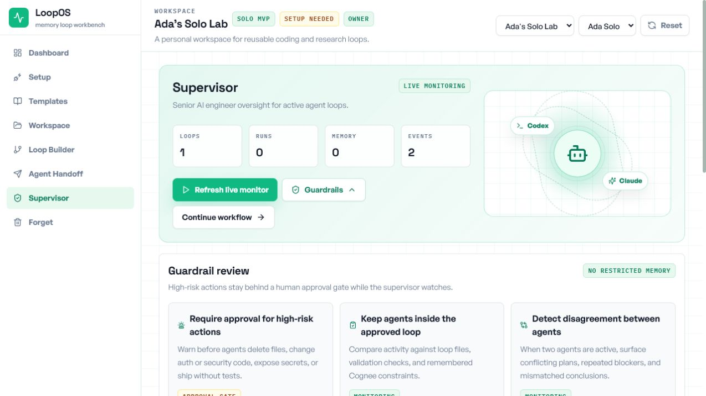
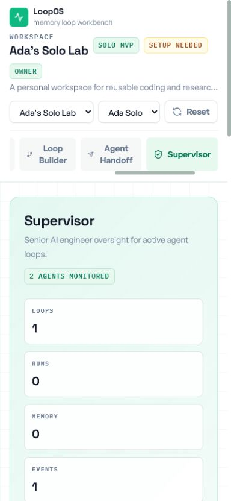

<div align="center">

# LoopOS

### Build AI workflows around Cognee's four memory actions: remember, recall, improve, and forget.

[](https://react.dev)
[](https://typescriptlang.org)
[](https://vite.dev)
[](https://tailwindcss.com)
[](https://www.cognee.ai)
[](https://www.alibabacloud.com/help/en/model-studio)
[](https://vitest.dev)

**Built for the WeMakeDevs Cognee Hackathon: AI that does not forget.**

[Quick Start](#quick-start) | [Core Memory Loop](#core-memory-loop) | [Features](#features) | [Architecture](#architecture) | [Deployment](#deployment)

</div>

---

## At A Glance

| Item | Details |
|---|---|
| Hackathon track | WeMakeDevs Cognee Hackathon |
| Core idea | Make AI workflows remember, recall, improve, and forget through Cognee-backed loops |
| Memory layer | Cognee Cloud, local Cognee, or deterministic demo fallback |
| Workflow lifecycle | Remember -> Recall -> Improve -> Forget |
| Agent support | Codex, Claude Code, generic CLI agents, and a Qwen-powered supervisor |
| Backend | Node.js API bridge that keeps Cognee and Qwen keys out of browser code |
| Frontend | React, TypeScript, Vite, Tailwind CSS |
| Deployment | Railway full-stack app with build output served by the Node bridge |

## Core Memory Loop

The main purpose of LoopOS is to make the four Cognee memory actions usable inside a real AI-agent workflow:

```text
REMEMBER -> RECALL -> IMPROVE -> FORGET
```

LoopOS does not treat memory as a vague chat feature. It turns memory into an explicit product loop with UI actions, role checks, audit events, backend routes, Cognee datasets, and agent handoff context.

| Cognee Action | What It Means In LoopOS | How LoopOS Makes It Possible |
|---|---|---|
| Remember | Save useful context so future agent runs do not start from zero | The user remembers project docs, loop files, and run notes. The Node bridge sends Markdown into Cognee datasets with stable LoopOS dataset names. |
| Recall | Bring back only the memory that is relevant and allowed | Before every loop run, LoopOS filters memory by workspace, role, and visibility, then asks Cognee to search only the allowed datasets. |
| Improve | Use remembered context and previous runs to make the workflow better | The Loop Builder combines recalled memory, current loop files, validation checks, and run notes into an improved execution plan. |
| Forget | Remove stale, wrong, restricted, or sensitive memory | The Forget page calls the backend to remove memory from Cognee and records the action in the audit trail. |

This is the core LoopOS promise: agents should not just remember everything forever. They should remember the right things, recall the right context, improve from prior work, and forget what should not affect the next run.

### The Four Actions In The Product

| Action | User-Facing Surface | Backend Route | Cognee / LoopOS Operation | Output |
|---|---|---|---|---|
| Remember | Dashboard, Workspace, Loop Builder | `POST /api/cognee/ingest`, `POST /api/cognee/remember-loop-file`, `POST /api/cognee/store-run` | Convert docs, loop files, and run notes into Markdown payloads, then store them in Cognee datasets | Durable memory source or run-note dataset |
| Recall | Loop Builder | `POST /api/cognee/recall` | Filter allowed memory sources, build a loop query, and search Cognee only across visible datasets | Dynamic context pack for the selected loop |
| Improve | Loop Builder, Agent Handoff | Local service logic plus recalled Cognee context | Combine loop files, validation checks, recalled memory, and prior run notes into a better execution plan | Improved plan, suggestions, handoff context |
| Forget | Forget page | `POST /api/cognee/forget` | Ask Cognee to remove the selected dataset and mark the memory as forgotten in LoopOS | Memory no longer appears in future recall |

### Why The Four Actions Are Connected

Remember alone is not enough. If the app only saves memory, the agent eventually drowns in stale context. LoopOS connects the four actions so memory becomes governed:

```text
Remember creates durable context.
Recall makes that context selective and permission-aware.
Improve turns the recalled context into a better next run.
Forget removes memory that should not keep shaping the agent.
```

### How The Four Actions Move Through The App

```text
1. REMEMBER
   Dashboard / Workspace / Loop Builder
   -> user saves docs, generated loop files, or run notes
   -> backend stores them in Cognee
   -> audit trail records the memory event

2. RECALL
   Loop Builder
   -> LoopOS checks which memories the current user can access
   -> backend searches only those Cognee datasets
   -> recalled context becomes the loop's dynamic context pack

3. IMPROVE
   Loop Builder / Agent Handoff
   -> recalled memory and prior runs are combined with the selected loop
   -> LoopOS produces a better plan, validation focus, and agent instructions
   -> the improved plan can be handed to Codex, Claude Code, or a CLI agent

4. FORGET
   Forget Page
   -> user selects memory that is stale, risky, or no longer useful
   -> backend asks Cognee to forget the dataset
   -> future recalls stop using that memory
```

### Why This Matters

| Without LoopOS | With LoopOS |
|---|---|
| Agents depend on copied chat context | Agents receive a repeatable memory-backed context pack |
| Important decisions vanish after each session | Useful docs, loop files, and run notes are remembered |
| Sensitive context can leak into future prompts | Role-aware recall filters memory before agents see it |
| Old or wrong context keeps influencing runs | The Forget step removes bad memory from the loop |
| Improvements live only in the human's head | Run notes and improvements become future memory |

## The Problem

AI coding and research agents are powerful, but most sessions are still disposable.

A developer gives an agent context, the agent runs, and then the hard-won decisions, mistakes, constraints, and improvements vanish into chat history or scattered logs. When teams use more than one agent, the problem gets sharper: Codex may edit code, Claude Code may reason through architecture, and the human has to manually compare outputs, remember guardrails, and decide what should carry forward.

```text
Common agent work
  -> one-off prompt
  -> context disappears
  -> every agent sees too much or too little
  -> no clear supervision layer
  -> memory only grows
```

## The Solution

LoopOS turns agent work into governed, repeatable memory loops built around the four memory actions.

```text
Choose a loop template
  -> edit structured loop files
  -> REMEMBER context in Cognee
  -> RECALL only allowed memory
  -> IMPROVE the workflow from prior runs
  -> hand off to Codex, Claude Code, or a CLI agent
  -> supervise the active loop with Qwen
  -> save run notes back into memory
  -> FORGET stale, wrong, or sensitive memory
```

The result is a solo-first AI workflow workbench where agents can reuse durable memory without losing permissions, guardrails, auditability, or the ability to forget.

## Features

### Loop Templates

LoopOS ships with five ready-to-duplicate loop playbooks:

| Template | Industry | What It Helps With |
|---|---|---|
| Web Builder & Maintainer | Frontend product engineering | Build, test, ship, and maintain web changes using remembered design and code context |
| Research Agent | Research and analysis | Gather, compare, source, and remember research context without mixing facts with assumptions |
| Code Review Agent | Software quality and security | Review code changes against project rules, prior incidents, and behavioral risk |
| Customer Support Agent | Support operations | Answer customer issues with remembered policy, prior fixes, tone rules, and escalation memory |
| Docs Maintainer | Developer education and knowledge ops | Keep product and engineering docs accurate, usable, and aligned with project style |

Each template generates eight structured Markdown files in the loop workspace:

```text
loop/     LOOP.md      - goal, inputs, steps, output, stop conditions
model/    MODEL.md     - model behavior, reasoning boundaries, decision style
soul/     SOUL.md      - agent identity, collaboration style, operating principles
memory/   MEMORY.md    - what to remember, recall, and forget
tools/    TOOLS.md     - tool map, Cognee usage, agent connectors
evals/    EVALS.md     - evaluation goals, checks, failure review
runbook/  RUNBOOK.md   - run sequence, operator notes, recovery
handoff/  HANDOFF.md   - prompt starter, required attachments, return contract
```

### Workspace And Loop Builder

The workspace lets a user edit generated files, remember them into Cognee, and run the selected loop with dynamic context.

| Area | Capability |
|---|---|
| Loop Workspace | Folder tree, editable Markdown files, template duplication, file-level memory |
| Loop Builder | Run selected loops, recall allowed Cognee memory, generate improvement plans |
| Run History | Store outcome notes and improvement suggestions for future recall |
| Export | Export loops as Markdown, JSON, or prompt bundles |

## Memory Lifecycle Details

LoopOS implements the full Cognee memory lifecycle:

```text
REMEMBER
  Ingest docs, loop files, and run notes into Cognee datasets.

RECALL
  Fetch only memory visible to the current user and relevant to the active loop.

IMPROVE
  Use recalled memory and prior run notes to produce a better plan.

FORGET
  Remove stale, wrong, restricted, or sensitive memory before it pollutes future work.
```

### Permission-Aware Recall

Memory sources have visibility policies: `workspace`, `private`, or `restricted`.

| Role | Recall Behavior |
|---|---|
| Owner / Manager | Can recall all workspace memory |
| Editor | Can recall workspace memory and restricted sources they are listed on |
| Viewer | Can recall workspace-only memory; restricted sources are excluded |

This means the app can demonstrate memory that is durable without making every memory visible to every agent or user.

### Cognee Modes

| Mode | Meaning |
|---|---|
| `live` | Cognee REST API is reachable and authenticated |
| `auth-needed` | Cognee is reachable but the key is missing or rejected |
| `api-mismatch` | Server is reachable but expected Cognee endpoints are missing |
| `demo-fallback` | Cognee is unavailable, so LoopOS simulates deterministic memory behavior |

## Qwen Supervisor

The Supervisor is the senior AI engineer view inside LoopOS. It monitors active agent lanes, compares signals, keeps guardrails visible, and gives the human an approval checkpoint before risky actions move forward.

When Qwen credentials are configured, activating the workflow calls the server-side Qwen supervisor through:

```text
POST /api/agent/supervisor
```

The Qwen key stays on the backend and is never sent to the browser.

| Stage | What The Supervisor Does |
|---|---|
| Activate Workflow | Attaches live monitoring and requests a Qwen verdict |
| Agent Monitor | Watches Codex and Claude Architect as separate lanes |
| Guardrails | Shows Qwen guardrails and keeps approval rules reviewable |
| Approval Gate | Surfaces high-risk actions before the workflow continues |
| Activity Feed | Keeps compact logs, run notes, and audit events at the bottom |
| Continue Workflow | Moves the user from supervision into the Forget step |

Qwen returns a structured verdict:

```json
{
  "verdict": "Workflow approved with monitoring",
  "riskLevel": "medium",
  "summary": "The active loop is observable and governed.",
  "guardrails": ["Require approval before deployment"],
  "nextAction": "Continue with monitored execution.",
  "disagreements": ["Claude Code log is not attached yet."]
}
```

## Agent Handoff

LoopOS prepares handoff bundles for multiple agent targets:

| Agent | Role | Bundle Contents |
|---|---|---|
| Codex | Implementation runner | `HANDOFF.md`, loop files, recalled memory, and runbook steps |
| Claude Code | Independent reviewer | Long-context review instructions and disagreement detection |
| Generic CLI | Open connector | Plain Markdown bundle for any compatible coding or research agent |

This gives the human a repeatable way to move context into agents and bring results back into memory.

## Roles, Permissions, And Audit

LoopOS includes role-aware workspace behavior:

```text
Owner    - full workspace, members, docs, loops, and permissions control
Manager  - manage members, docs, loops, and permissions
Editor   - create and edit allowed loops and memory sources
Viewer   - view and run allowed loops only
```

Important events are recorded in the audit trail:

| Event | Example |
|---|---|
| `memory.created` | Created a project memory source |
| `memory.ingested` | Stored a source in Cognee |
| `memory.access_changed` | Restricted memory to selected users |
| `memory.forgotten` | Removed a Cognee dataset |
| `loop.duplicated` | Duplicated a loop from a template |
| `loop.edited` | Updated a generated loop file |
| `loop.improved` | Recalled memory and generated an improved plan |
| `run.completed` | Stored run notes for future recall |

## Demo Walkthrough

| Step | Page | What To Show |
|---|---|---|
| 1 | Dashboard | Choose hosted Cognee demo, local Cognee, or Cognee Cloud and see connection status |
| 2 | Templates | Browse five loop patterns and duplicate one into the workspace |
| 3 | Loop Workspace | Edit `LOOP.md`, `SOUL.md`, `MEMORY.md`, and other generated files |
| 4 | Loop Builder | Run the loop and recall permission-filtered Cognee memory |
| 5 | Agent Handoff | Review the generated bundle and choose Codex, Claude Code, or CLI |
| 6 | Supervisor | Activate monitoring and receive a Qwen risk verdict with guardrails |
| 7 | Forget | Remove stale, wrong, or sensitive memory from future runs |

## Visual Tour

| Supervisor Desktop | Supervisor Mobile |
|:---:|:---:|
|  |  |
| Supervisor view after the memory loop has produced agent activity | Responsive monitoring view with active agent animation and streaming status |

## Architecture

```text
React + Vite frontend
  Dashboard
  Templates
  Loop Workspace
  Loop Builder
  Agent Handoff
  Supervisor
  Forget
  Run History
  Export

Browser service layer
  src/services/cognee.ts
  src/services/loopActions.ts
  src/services/permissions.ts
  src/services/supervisorAgent.ts
  src/services/loopExport.ts

Node API bridge
  GET  /api/cognee/status
  POST /api/cognee/ingest
  POST /api/cognee/remember-loop-file
  POST /api/cognee/recall
  POST /api/cognee/store-run
  POST /api/cognee/forget
  POST /api/cognee/local/start
  POST /api/agent/supervisor

External services
  Cognee REST API
  Qwen via DashScope OpenAI-compatible chat completions
```

## Cognee Integration

The Node bridge keeps Cognee credentials out of browser code. The frontend calls `/api/cognee/*`, and the backend proxies to Cognee REST endpoints when available.

The bridge uses:

```text
POST /api/v1/add
POST /api/v1/cognify
POST /api/v1/search
POST /api/v1/forget
POST /api/v1/remember  # compatibility fallback
```

For the hosted hackathon demo, use the LoopOS demo Cognee Cloud variables:

```env
LOOPOS_DEMO_COGNEE_BASE_URL=https://your-cognee-cloud-tenant-url
LOOPOS_DEMO_COGNEE_AUTH_MODE=api-key
LOOPOS_DEMO_COGNEE_API_KEY=your-cognee-cloud-key
```

For local development with a Cognee server running on your machine:

```env
COGNEE_BASE_URL=http://127.0.0.1:8000
COGNEE_AUTH_MODE=none
COGNEE_API_KEY=
```

Do not use `COGNEE_BASE_URL=http://127.0.0.1:8000` on Railway. In Railway, `127.0.0.1` points to the Railway container, not your laptop or Cognee Cloud.

## Qwen Environment

```env
DASHSCOPE_API_KEY=your-dashscope-api-key
QWEN_BASE_URL=https://dashscope-intl.aliyuncs.com/compatible-mode/v1
QWEN_MODEL=qwen-plus
```

## Tech Stack

| Layer | Technology | Why |
|---|---|---|
| Frontend | React 19, TypeScript | Component-first, type-safe UI |
| Build tool | Vite 6 | Fast development and clean production output |
| Styling | Tailwind CSS and custom LoopOS CSS | Utility-first layout with a custom product feel |
| Icons | lucide-react | Consistent, tree-shakeable icon set |
| Backend bridge | Node.js built-in HTTP server | Simple deployable API and static asset server |
| Memory | Cognee REST API | Knowledge graph recall and dataset lifecycle |
| Supervisor AI | Qwen `qwen-plus` via DashScope | Backend-only OpenAI-compatible model call |
| State | Browser localStorage | MVP-friendly persistence and reset behavior |
| Testing | Vitest, Testing Library, jsdom | Service and UI regression coverage |
| Deployment | Railway | Full-stack hosting for frontend, API bridge, and secrets |

## Quick Start

### Prerequisites

- Node.js 20+
- npm 10+
- Optional: Cognee local or Cognee Cloud
- Optional: DashScope API key for the Qwen supervisor

### Clone And Install

```bash
git clone https://github.com/adetorojeremiahfadesayo/LoopsOs.git
cd LoopsOs
npm install
```

### Configure Environment

```bash
cp .env.example .env
```

On Windows PowerShell:

```powershell
Copy-Item .env.example .env
```

Fill in the values that match your setup. If you do not have Cognee or Qwen keys, LoopOS can still run in demo fallback mode.

### Run Locally

```bash
npm run dev:full
```

Open:

```text
http://127.0.0.1:5173
```

The full dev command starts:

| URL | Purpose |
|---|---|
| `http://127.0.0.1:5173` | Vite frontend |
| `http://127.0.0.1:8787/api/cognee/status` | Node API bridge health check |

## Deployment

### Railway Recommended

Railway is the best fit because LoopOS uses a Vite frontend and a Node API bridge for Cognee and Qwen secrets.

```text
Build command: npm run build
Start command: npm start
```

Railway variables:

```env
NODE_ENV=production

DASHSCOPE_API_KEY=your-dashscope-api-key
QWEN_BASE_URL=https://dashscope-intl.aliyuncs.com/compatible-mode/v1
QWEN_MODEL=qwen-plus

LOOPOS_DEMO_COGNEE_BASE_URL=https://your-cognee-cloud-tenant-url
LOOPOS_DEMO_COGNEE_AUTH_MODE=api-key
LOOPOS_DEMO_COGNEE_API_KEY=your-cognee-cloud-key
```

Remove this variable from Railway if it exists:

```env
COGNEE_BASE_URL=http://127.0.0.1:8000
```

That value is only for local development.

After deployment:

1. Generate a Railway public domain.
2. Open the app.
3. Go to the Supervisor page.
4. Click `Activate workflow`.
5. Confirm the central verdict updates from Qwen.

### Vercel

Vercel can host the static frontend, but the API bridge must still live somewhere else. Use Vercel only if `/api/*` is proxied to a backend such as Railway.

See [docs/DEPLOYMENT.md](docs/DEPLOYMENT.md) for more deployment notes.

## Quality And Testing

```bash
npm test
npm run build
```

Current verified status:

```text
22 test files passed
73 tests passed
Production build passed
```

Test coverage includes:

| Layer | Coverage |
|---|---|
| `server/cogneeClient.js` | Dataset naming, add/cognify fallback paths, auth headers, errors |
| `server/qwenSupervisor.js` | Qwen endpoint call, structured verdict normalization, error handling |
| `server/runtimeConfig.js` | Header-based environment overrides |
| `server/localCognee.js` | Local Cognee launcher behavior |
| `src/services/cognee.ts` | Bridge calls and demo fallback |
| `src/services/loopActions.ts` | Loops, files, memory sources, permissions, run records |
| `src/services/permissions.ts` | Role-based access decisions |
| `src/pages/*` | Render and workflow tests with React Testing Library |

## Security

- Never commit real API keys, tokens, private logs, or sensitive memory.
- Keep secrets in `.env`, `.env.local`, Railway variables, or Vercel environment variables.
- Cognee and Qwen credentials live on the backend only.
- Permission filtering happens before recall.
- Use the Forget page to remove stale, wrong, or sensitive memories.

Before public submission, verify no real secret files are tracked:

```bash
git ls-files -- ".env*" "**/.env*"
```

That command should not show real secret files.

## Project Structure

```text
LoopsOs/
  src/
    components/              shared UI and lifecycle widgets
    domain/                  types, seed state, loop template definitions
    pages/                   dashboard, templates, workspace, builder, handoff, supervisor, forget
    services/                Cognee calls, loop actions, permissions, export, supervisor client
  server/
    index.js                 Node API bridge and production static server
    cogneeClient.js          Cognee REST adapter
    qwenSupervisor.js        Qwen supervisor adapter
    localCognee.js           Docker-based local Cognee launcher
    runtimeConfig.js         request header to environment override
    env.js                   local .env loader
  docs/
    DEPLOYMENT.md            deployment notes
  public/
    loopos-assets/           screenshots and public assets
```

## Submission Checklist

| Item | Status |
|---|---|
| Cognee memory lifecycle: Remember, Recall, Improve, Forget | Complete |
| Solo-first judgeable flow | Complete |
| Five reusable loop templates | Complete |
| Eight generated Markdown files per template | Complete |
| Editable loop workspace | Complete |
| Permission-aware memory recall | Complete |
| Audit trail | Complete |
| Backend-only Cognee Cloud key path | Complete |
| Agent handoff bundles for Codex, Claude Code, and CLI | Complete |
| Qwen-powered Supervisor monitoring page | Complete |
| Guardrails and high-risk approval review | Complete |
| Tests passing | Complete |
| Production build passing | Complete |
| Live deployed app URL | Pending |
| Demo video URL | Pending |
| Hackathon submission URL | Pending |

## LoopOS vs Common Agent Workflows

| Common Agent Workflow | LoopOS |
|---|---|
| One-off prompts | Repeatable loop templates with structured files |
| Context disappears after a run | Cognee-backed memory sources and run notes |
| Every agent sees everything | Permission-aware recall before agent handoff |
| No clear workflow files | Generated `LOOP`, `MODEL`, `SOUL`, `MEMORY`, `TOOLS`, `EVALS`, `RUNBOOK`, and `HANDOFF` files |
| No supervision layer | Qwen Supervisor with risk verdicts and guardrails |
| Memory only grows | Explicit Forget step for stale or sensitive context |
| Single-agent assumption | Codex and Claude Code lanes with disagreement monitoring |

---

<div align="center">

**Built so agents remember the right things, forget the risky things, and keep the human in the loop.**

LoopOS - WeMakeDevs Cognee Hackathon 2026

</div>
